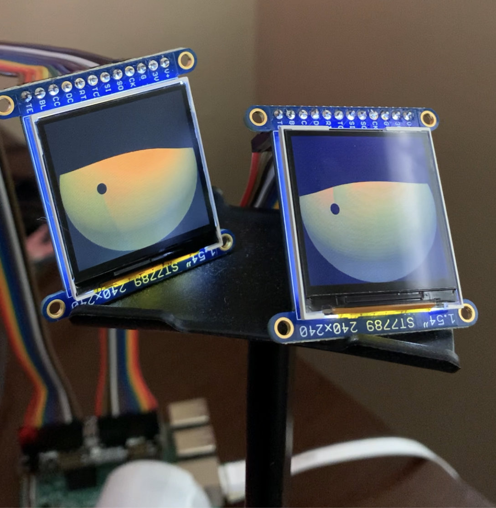

# Pi_Eyes

## DIY Nightmare Before Christmas Man Eating Wreath (Disneyland Haunted Mansion Overlay)

👋 I'm trying to re-create a _killer_ prop inside the disneyland haunted mansion. This particular componet is the digital eyes that move around and blink. This is forked from the primary software for the Adafruit Pi_Eyes project - not that this project will contribute back to the core just so this holds lineage and shows where the new files go. 



_Following the Adafruit tutorial [here](https://learn.adafruit.com/animated-snake-eyes-bonnet-for-raspberry-pi/customizing-the-look)_

## Bring Custom Graphics

See `/boot/Pi_Eyes/graphics` 

To update the files in `eyes.py` go to l:122

* Update the svg and the png

```python
# Load texture maps --------------------------------------------------------

irisMap   = pi3d.Texture("graphics/iris.jpg"  , mipmap=False,
              filter=pi3d.GL_LINEAR)
scleraMap = pi3d.Texture("graphics/sclera.png", mipmap=False,
              filter=pi3d.GL_LINEAR, blend=True)
```


## How to update 

1. Plug the pi sd card into computer 

2. Find/replace files in the mounted /boot/Pi_Eyes directory

3. Edit the `eyes.py` file


## TODO

Update installer script

```sh
cd
curl https://raw.githubusercontent.com/adafruit/Raspberry-Pi-Installer-Scripts/master/pi-eyes.sh >pi-eyes.sh
sudo bash pi-eyes.sh
```

Get better graphics

Larger (slightly) pupil 